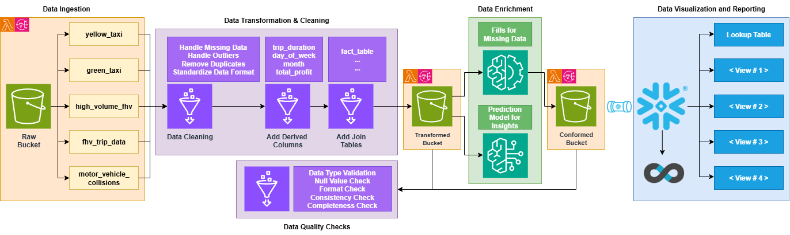
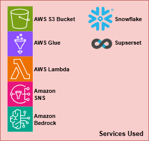
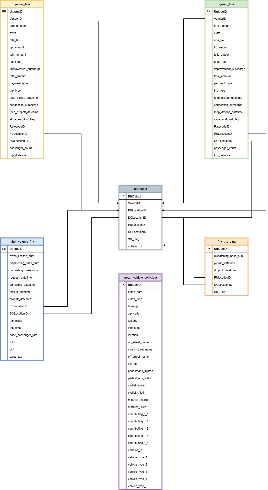

# TechCatalyst Data Engineering Capstone Project
Using the NYC Taxi trip data (2024–2025), our goal is to build a complete data pipeline from ingestion to analysis to show insights about the data. 

## Statement of Purpose

Given various taxi data sources, we want to identify the best tendencies for drivers to have in order to maximize their profits drivings in New York.

### Objectives:
* Profitability by Location 
    * Which boroughs generate the highest profits for drivers? 
* Temporal Trends 
    * What times of day yield the most income for drivers? 
    * What times are most popular among riders? 
* Service Comparison 
    * Which ride service (e.g., green taxi, yellow taxi, HVFHV) provides the greatest profit margins? 
* Tipping Behavior 
    * In which areas do riders tend to tip the most? 
* Impact of Tolls 
    * Do tolls significantly affect ride profitability? 
* Trip Characteristics 
    * What are the most frequent ride distances? 
    * What are the most common trip durations? 
* Safety Insights 
    * Which areas should drivers avoid due to high accident rates? 
    * Which boroughs report the most vehicle collisions? 
* Rider Preferences 
    * What ride services are preferred in each borough? 
### Tables Used: 
1. green_taxi: Trip-level data for NYC green taxis. 
2. yellow_taxi: Trip-level data for NYC yellow taxis. 
3. hvdhv: High-volume for-hire vehicle trip data. 
4. motor_vehicle_collisions___crashes_20250809_csv: Records of motor vehicle crashes in NYC. 
5. motor_vehicle_collisions___vehicles_20250809_csv: Details on vehicles involved in NYC collisions. 

## Diagrams:
#### Architecture Diagram
  

  

#### Star-Schema Diagram:

